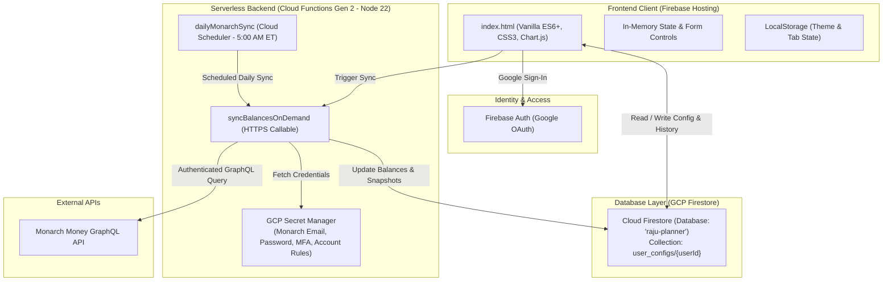
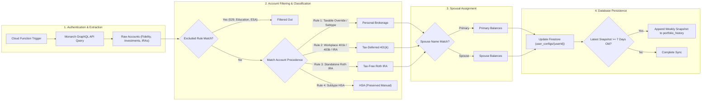
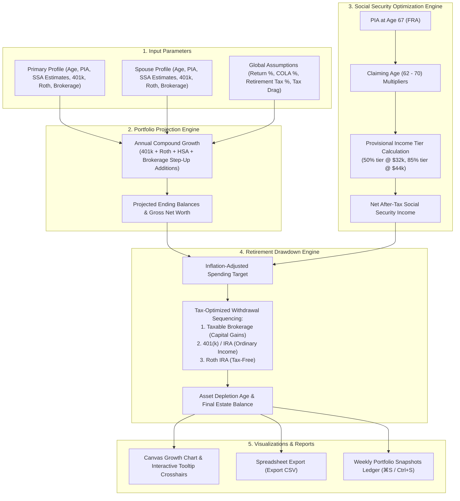

# Financial Forecast & Retirement Strategy Optimizer

A high-performance, responsive single-page web application and serverless platform for financial forecasting, retirement drawdown simulations, Social Security break-even analysis, spousal strategy optimization, and automated weekly net worth tracking.

---

## 🏛️ System Architecture

The application uses a hybrid serverless architecture combining a zero-compilation static client SPA hosted on **Firebase Hosting** with **GCP/Firebase Cloud Functions (2nd Gen)** for automated financial data aggregation.



---

## 🛠️ Technology Stack

| Layer | Technology / Library | Purpose |
| :--- | :--- | :--- |
| **Frontend Framework** | Vanilla HTML5, ES6+ JavaScript | Zero-build, instant loading static client application |
| **Styling & Design System** | Vanilla CSS3 (Custom Design Tokens) | Glassmorphism UI, light/dark mode support, responsive grid, smooth animations |
| **Visualizations** | Canvas API & Chart.js | Dynamic canvas charts for portfolio projections, hover crosshairs, & SS breakeven |
| **Authentication** | Firebase Auth SDK (v10 compat) | Google OAuth session management |
| **Database** | Cloud Firestore (`raju-planner` instance) | Remote document persistence for user states & portfolio snapshot history |
| **Cloud Hosting** | Firebase Hosting | CDN hosting under domain `https://rajuplanner.web.app` |
| **Serverless Functions** | Firebase Cloud Functions (2nd Gen, Node 22) | Automated background sync & GraphQL data integration |
| **External API Sync** | `monarch-money-ts` GraphQL Client | Fetch real-time account balances from Monarch Money |
| **Secrets Manager** | GCP Secret Manager | Securely stores Monarch credentials & target user IDs |
| **Scheduler** | GCP Cloud Scheduler | Triggers daily Monarch sync cron at 5:00 AM ET (`0 5 * * *`) |
| **Accessibility & UX** | WAI-ARIA & Keyboard Shortcuts | Modal dialog accessibility, `Escape` dismissal, `⌘S` / `Ctrl+S` snapshot shortcut |

---

## 🔄 Monarch Aggregation & Classification Pipeline

The diagram below outlines how the serverless background worker authenticates with Monarch Money, extracts account balances, applies regex & subtype precedence rules, categorizes holdings into Primary and Spouse accounts, and automatically records weekly net worth snapshots.



---

## 📊 Application Calculation & Drawdown Engine Flow

The core application operates an interconnected financial simulation pipeline across portfolio growth, Social Security claiming optimization, and tax-aware retirement drawdown sequencing:



---

## 📊 Dynamic vs. Hardcoded Logic

To ensure accurate review by developers and AI agents, the table below categorizes what is dynamically configured by users versus what is hardcoded as constant financial baseline rules.

### 1. Dynamic / User-Configurable Parameters

| Category | Parameter | Description / Behavior |
| :--- | :--- | :--- |
| **User Profiles** | Names, Birth Month & Year | Primary (`p1`) and Spouse (`p2`). Ages are computed dynamically relative to current date. |
| **Social Security Statements** | PIA & SSA Estimates | Primary and Spouse Primary Insurance Amount (PIA) at FRA (67), plus custom statement estimates for ages 62–70. |
| **Account Balances** | 401(k), Roth IRA, HSA, Brokerage | Primary and spouse balances. Monarch sync updates matched retirement, Roth, and brokerage accounts; HSA remains manual. |
| **Contributions & Matches** | Additions & Employer Matches | 401(k) employee & employer additions (bi-weekly, 26 pay periods/yr), HSA additions (bi-weekly), Roth IRA additions (monthly), and Brokerage additions (monthly). |
| **Global Assumptions** | Return Rate (%) | Annual portfolio compound return rate (synced across all views). Quick preset buttons available (8%, 9%, 10%, 11.2%, 12%). |
| **Global Assumptions** | Inflation / COLA (%) | Annual inflation rate used for Cost-of-Living-Adjustments (COLA) and real-dollar purchasing power views. |
| **Global Assumptions** | Withdrawal Tax Rate (%) | Effective tax rate on 401(k) / Tax-Deferred withdrawals in retirement. |
| **Tax Settings** | Tax Drag & Capital Gains Rate | Annual drag % and final capital gains tax % on Taxable Brokerage accounts. |
| **Retirement Parameters** | Target Retirement Age | Claiming age for Social Security, stop working age, and life expectancy (Primary & Spouse). |
| **History & Snapshots** | Settings History & Portfolio History | User configurations version ledger and weekly portfolio net worth snapshots. Quick keyboard trigger via `⌘S` / `Ctrl+S`. |

### 2. Hardcoded / Financial Baseline Constants

| Constant Rule | Value | Rationale / Source |
| :--- | :--- | :--- |
| **Full Retirement Age (FRA)** | Age 67 | Model assumption appropriate for people born in 1960 or later. |
| **Standard Early/Late SSA Multipliers** | 62: 70%, 63: 75%, 64: 80%, 65: 86.7%, 66: 93.3%, 67: 100%, 68: 108%, 69: 116%, 70: 124% | Statutory Social Security reduction/delay benefit multipliers (overridden dynamically if custom statement estimates are provided). |
| **SSA Provisional Tax Thresholds (Joint)** | 50% tax tier at $32,000; 85% tax tier at $44,000 | IRS combined income thresholds determining taxable portion of Social Security benefits. |
| **SSA Provisional Tax Thresholds (Single)** | 50% tax tier at $25,000; 85% tax tier at $34,000 | IRS combined income thresholds for individual filers. |
| **401(k) Limit (2026)** | $24,500; $32,500 at 50+; $35,750 at ages 60-63 | IRS annual employee contribution limits. Employer match is modeled separately and is not capped by this employee limit. |
| **IRA Limit (2026)** | $7,500; $8,600 at 50+ | IRS annual contribution limits. Roth income eligibility phase-outs are not modeled. |
| **Family HSA Limit (2026)** | $8,750 plus $1,000 per eligible spouse age 55+ | Assumes family HDHP coverage and combines household catch-up amounts for projection purposes. |

---

## 🔒 Security & Security Rules

### Firestore Security Rules (`firestore.rules`)
```javascript
rules_version = '2';
service cloud.firestore {
  match /databases/{database}/documents {
    match /user_configs/{userId} {
      allow read, write: if request.auth != null && request.auth.uid == userId;
    }
  }
}
```

### On-Demand Cloud Function Security
The `syncBalancesOnDemand` callable requires Firebase authentication and compares `request.auth.uid` with the `TARGET_USER_ID` secret. Firestore rules independently restrict each document to the matching authenticated UID. Callable errors are sanitized before being returned to the browser, and account names and balances are not written to logs.

---

## 🚀 Local Development & Deployment

Prerequisites: Node.js 22, npm, and Firebase CLI.

```bash
# 1. Build Cloud Functions
cd functions
npm ci
npm run build

# 2. Deploy Everything to Firebase
npx -y firebase-tools deploy
```

Production Web Host: [https://rajuplanner.web.app](https://rajuplanner.web.app)

---

## ⚠️ Model Scope and Limitations

- Results are deterministic planning estimates, not financial, tax, or Social Security advice.
- FRA is fixed at 67; profiles born before 1960 require a birth-year-specific FRA implementation.
- The stop-work adjustment is an approximation, not SSA's indexed 35-year earnings-record calculation.
- Federal Social Security provisional-income thresholds are modeled; state taxes, deductions, filing-status changes, IRMAA, RMDs, NIIT, and detailed tax brackets are not.
- Roth IRA income phase-outs and future inflation adjustments to contribution limits are not modeled. The current 2026 nominal limits are reused in future projection years.
- HSA balances are treated as tax-free spendable assets and contribution caps assume family coverage. Non-qualified withdrawals and coverage eligibility are not modeled.
- Survivor benefits are approximated as the larger of the two ARF-adjusted streams, paid immediately upon the first death; survivor claiming-age rules (eligibility from age 60, survivor-specific reductions) are not modeled.
- In the drawdown simulator, Social Security income above the inflation-adjusted spending target is treated as spent, not reinvested.
- Monarch account classification depends on account names/subtypes and configured match rules. Exclude rules match against the institution name as well as account names. Review sync output in the UI before relying on aggregated balances.
